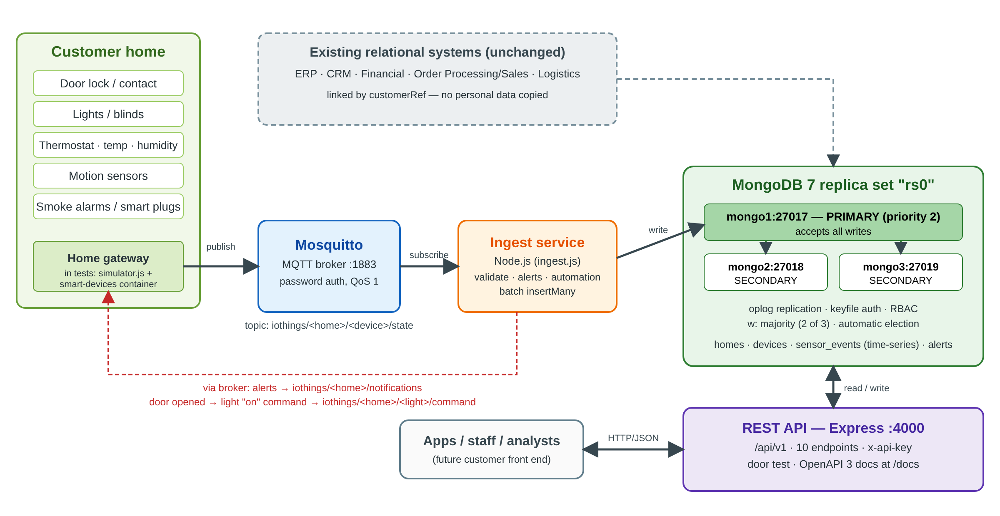
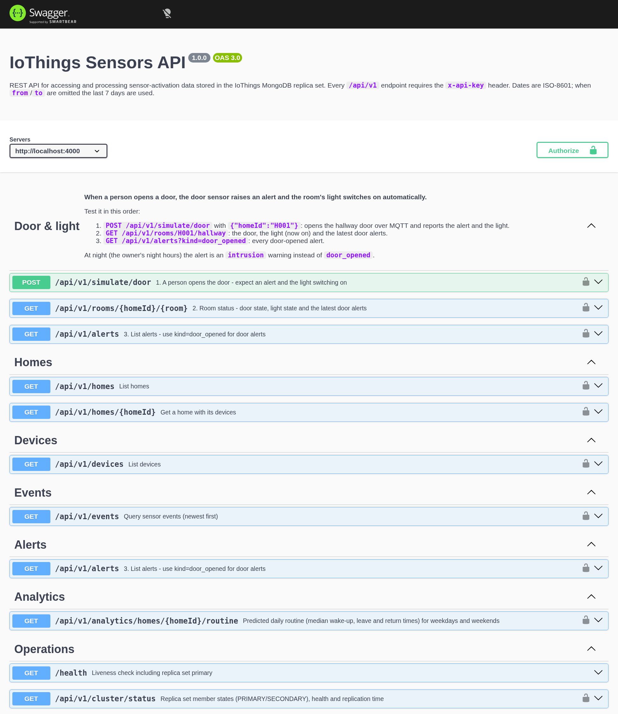

# IoThings Sensors Database
### NoSQL Design and Implementation Report

**Prepared for:** IoThings Home Automation Solutions (UK SME)
**Prepared by:** [Your name], Consultant Data Scientist / Programmer / Analyst
**Module context:** CMP6207 Modern Data Stores (personal learning project)
**Date:** October 2026

---

## Contents

---

## Executive Summary

IoThings installs smart sensors in customers' homes and needs a secure, reliable place to store the activation messages those sensors send over MQTT. This report recommends, designs and demonstrates a MongoDB document database running as a three-member replica set, fed by a Node.js ingest service and exposed through a documented REST API.

The implemented system stores sensor events in a compressed time-series collection, validates every message before it is saved, raises safety alerts and runs home automation. When a person opens a door, the system raises an alert and switches that room's light on automatically. A crash of the primary database server was simulated: a new primary was elected in about 10 seconds and data continued to be saved throughout. Security is layered across the cluster, the database users, the message broker and the API, and data retention follows UK GDPR.

The system was evaluated with a reproducible dataset of 20 homes, 480 devices and 289,646 sensor events. It runs entirely in Docker and can be started with one command. The report concludes that IoThings should adopt MongoDB alongside, not instead of, its existing relational systems.

---

## 1. Introduction

IoThings Home Automation Solutions is a UK start-up that automates homes with smart door locks, lights, blinds, thermostats, motion detectors and smoke alarms. Each device publishes small messages over MQTT (MQ Telemetry Transport) whenever it is activated. IoThings wants to use this data to give customers feedback about device usage, predict household activity and keep homes and occupants safe, for example by sending a notification when a smoke alarm sounds.

The company already runs relational systems for Enterprise Resource Planning (ERP), Customer Relationship Management (CRM), finance, order processing and logistics. These remain unchanged. What is missing is a store for sensor activation data, which arrives continuously, in large volumes and in a variety of shapes. IoThings has also asked for a "three cluster" MongoDB system, because it is concerned about the security and availability of its data, and for a simple Node.js server and an API to receive, access and process the data.

This report is written for IoThings' management, who are new to NoSQL. Section 2 introduces the principal types of NoSQL database. Section 3 critically compares relational and document databases in general terms, so that the analysis remains useful if IoThings chooses a different vendor. Section 4 presents the design and implementation of the sensors database, including installation, configuration, security, data management and a failover test. Section 5 documents the API. Section 6 summarises the case for investment and proposes future work. The appendices describe the test dataset and the test results.

---

## 2. Principal Types of NoSQL Databases

### 2.1 What "NoSQL" means

"NoSQL" is best read as "Not Only SQL". It describes a family of databases that do not use the relational table model as their primary way of storing data. They emerged in the late 2000s when web companies needed to store very large, fast-changing and loosely structured data across many commodity servers (Cattell, 2011). NoSQL databases usually trade some of the strict guarantees of relational systems for horizontal scalability, flexible schemas and high availability. Sadalage and Fowler (2012) group them into four principal types: key-value, document, wide-column and graph. The first three are "aggregate-oriented": they store a whole unit of related data, an aggregate, together, so it can be read and written in a single operation and moved between servers as one piece.

### 2.2 Key-value stores

A key-value store holds opaque values that are looked up by a unique key, much like a large distributed hash table. Redis and Amazon DynamoDB are well-known examples; Amazon's Dynamo paper (DeCandia et al., 2007) showed how such a store can stay available during network failures by replicating data across nodes and accepting eventual consistency.

- **Strengths:** very fast reads and writes by key, simple to scale out, ideal for caching and session data.
- **Weaknesses:** the database cannot search inside values, so any query other than "get by key" must be handled by the application.
- **Relevance to IoThings:** suitable for caching the latest state of each device or for user sessions, but not as the main store for analysis.

### 2.3 Document stores

A document store saves self-describing documents, usually JSON or its binary form BSON, and can index and query any field inside them. MongoDB and Couchbase are leading examples. Related data that is used together can be embedded in one document, which removes the need for many joins.

- **Strengths:** flexible schema, rich queries and secondary indexes, aggregation for analysis, and a data model that maps naturally to objects in application code.
- **Weaknesses:** without discipline, data can become inconsistent; joins across collections are possible but less efficient than in a relational database.
- **Relevance to IoThings:** a very good fit. Each sensor message is naturally a small document, device types differ in what they report, and MongoDB offers time-series collections designed for this kind of data.

### 2.4 Wide-column stores

Wide-column stores, inspired by Google's Bigtable (Chang et al., 2006) and implemented in Apache Cassandra and HBase, organise data into rows with very large, sparse sets of columns grouped into column families. Cassandra distributes data across a ring of peer nodes with no single master (Lakshman and Malik, 2010).

- **Strengths:** outstanding write throughput and linear scalability across data centres, well suited to time-ordered data.
- **Weaknesses:** queries must be planned in advance around the partition key; ad-hoc queries and aggregations are limited; operations are complex.
- **Relevance to IoThings:** a credible option at very large scale (millions of homes), but more complex than IoThings needs today.

### 2.5 Graph databases

Graph databases such as Neo4j store nodes and the relationships between them as first-class data, so traversing connections is fast regardless of the size of the dataset (Angles and Gutierrez, 2008).

- **Strengths:** natural for highly connected data such as social networks, recommendations and dependency analysis.
- **Weaknesses:** harder to distribute across servers; not designed for high-volume append-only data.
- **Relevance to IoThings:** could model relationships between homes, rooms, devices and automation rules in future, but is not suited to storing raw sensor events.

**Table 1:** _Summary of the four NoSQL types_

| Type | Data model | Examples | Main strength | Main weakness | Fit for IoThings sensor data |
|---|---|---|---|---|---|
| Key-value | Key → opaque value | Redis, DynamoDB | Speed, simplicity | Query by key only | Cache only |
| Document | JSON/BSON documents | MongoDB, Couchbase | Flexible, rich queries | Integrity is the designer's job | **Best fit** |
| Wide-column | Rows with column families | Cassandra, HBase | Massive write scale | Queries fixed by design | Future, at very large scale |
| Graph | Nodes and edges | Neo4j | Relationship queries | Hard to distribute | Not for events |

### 2.6 Underlying theory: CAP, PACELC and BASE

Distributed databases are shaped by the **CAP theorem**: when a network partition occurs, a system must choose between consistency (every read sees the latest write) and availability (every request receives a response) (Brewer, 2012; Gilbert and Lynch, 2002). Abadi's (2012) **PACELC** refinement adds that, even without a partition, there is a trade-off between latency and consistency. Many NoSQL systems follow **BASE** ("basically available, soft state, eventually consistent") rather than ACID (Pritchett, 2008). These are not fixed labels: MongoDB lets the application choose. The design in Section 4 uses majority write concern, favouring consistency and durability for acknowledged writes, while automatic failover keeps the system available when one server fails.

---

## 3. Critical Comparison of Relational and Document Databases

This section compares the relational model with document (key-value document) databases in general terms. NoSQL should be understood as an **extension** of the data management toolkit, not a replacement for SQL: each model is strong where the other is weak.

### 3.1 Data model and schema

The relational model stores data in normalised tables with a fixed schema and enforces relationships through foreign keys (Codd, 1970). This guarantees integrity and removes duplication, but every change of structure needs a schema migration. Document databases store each record as a self-contained document, and documents in the same collection may differ. This flexibility speeds up development and suits data whose shape varies, such as sensors that report a state, a numeric value, a battery level or all three. The cost is that integrity moves from the database to the designer. A critical point is that flexibility does not have to mean "no rules": modern document databases support schema validation, which the IoThings design uses to reject invalid documents (Section 4.4).

### 3.2 Relationships and joins

Relational databases excel at joining many tables in one query. Document databases encourage embedding related data that is read together, which avoids joins entirely, or referencing it when it is large, shared or frequently changing. Joins are possible (MongoDB's `$lookup`), but they are less efficient and less central to the model. The trade-off is therefore about access patterns: a document design is fast for the queries it was designed for, while a relational design is more neutral and better for unforeseen queries across many entities.

### 3.3 Transactions and consistency

Relational databases provide ACID transactions by default, which is essential for finance and orders. Early NoSQL systems relaxed these guarantees in favour of availability and scale. The gap has narrowed: MongoDB supports multi-document ACID transactions and lets each operation choose its write concern and read preference. However, transactions spanning many documents or shards cost performance, so a document design should keep data that changes together in one document wherever possible. For sensor data, where each event is an independent fact that is never updated, single-document atomicity is sufficient.

### 3.4 Scalability and availability

Relational databases traditionally scale **vertically** by buying a larger server; scaling writes across machines is possible but complex. Document databases are designed to scale **horizontally**: replication provides availability and read capacity, and sharding spreads data and writes across servers (Cattell, 2011). Stonebraker (2010) cautions that much of NoSQL's performance advantage comes from avoiding overheads such as logging and locking rather than from the data model itself, and that a well-tuned relational system can be very fast. This is a fair criticism; the strongest argument for a document store here is the combination of scale-out, availability and a natural fit for the data, not raw speed alone.

### 3.5 Query language, tooling and skills

SQL is a mature, standardised language with decades of tools, reporting software and trained staff. Document databases use product-specific APIs; MongoDB's aggregation framework is powerful but must be learned, and skills are less widespread. Moving between NoSQL vendors is also harder than moving between SQL databases. This is a genuine business risk and a reason to keep the design simple and well documented. Ad-hoc reporting is another weakness: business-intelligence tools speak SQL natively, whereas reporting on a document store usually needs a connector or an export, so the relational systems remain the natural home for company-wide reporting.

### 3.6 Write-heavy, time-ordered workloads

Sensor data has an unusual shape: it is written constantly, almost never updated and usually read as "the readings for this device over this period". In a relational database each reading becomes a row, and every insert must update the table's indexes and, typically, transaction logs, so very high insert rates call for careful tuning, partitioning or a specialised extension. A document store can append readings with little overhead, and time-series features group readings by source and time so that both storage and range queries are efficient. The counter-argument is that this advantage only matters at volume: for a few hundred homes a relational table would cope. The case for a document store therefore rests on IoThings' expected growth as well as its current size, which is why the evaluation below weighs scalability heavily.

### 3.7 Evaluation for IoThings

**Table 2:** _Relational compared with document databases_

| Criterion | Relational | Document store | Better for IoThings sensor data |
|---|---|---|---|
| Schema | Fixed, enforced | Flexible, optional validation | Document: new device types without migrations |
| Relationships | Joins, foreign keys | Embed or reference, limited joins | Document: events are read by device and time |
| Transactions | ACID by default | Tunable; multi-document ACID available | Both adequate: events are independent |
| Scaling | Mainly vertical | Horizontal (replication, sharding) | Document |
| Time-series data | Generic tables | Compressed time-series collections | Document |
| Query language | Standard SQL | Vendor-specific | Relational |
| Maturity and skills | Very high | Growing | Relational |

The evaluation shows a split. For finance, orders and customer records, where relationships and strict consistency dominate, the relational model remains the better choice, so IoThings' existing systems should stay as they are. For sensor activation data, which is high-volume, append-only, varied in shape and queried by device and time, a document store is the better fit. This approach, using different databases for different jobs, is known as **polyglot persistence** (Sadalage and Fowler, 2012). In this design the two worlds are linked by a single customer reference, so personal data stays in the CRM.

---

## 4. IoThings NoSQL Database Design and Implementation

### 4.1 Architecture and technology choices

Figure 1 shows the architecture. Sensors in the home publish MQTT messages to an Eclipse Mosquitto broker. A Node.js ingest service subscribes to those messages, validates them, applies alert and automation rules and writes them in batches to a three-member MongoDB replica set. A REST API built with Express gives applications access to the data. In testing, a simulator plays the home gateway and a `smart-devices` container plays the lights, obeying the commands the automation sends.



**Table 3:** _Technology choices_

| Component | Choice | Version | Reason |
|---|---|---|---|
| Database | MongoDB replica set `rs0` | 7.0 | Document model, time-series collections, automatic failover |
| Message broker | Eclipse Mosquitto | 2 | Lightweight, standard MQTT broker (OASIS, 2019) |
| Ingest and API | Node.js with Express 4, MongoDB driver 6, MQTT.js 5 | 22 | Asynchronous I/O suits many small messages |
| Deployment | Docker Compose | v2 | Whole system reproducible with one command |

The system runs as seven containers: `mongo1`, `mongo2`, `mongo3`, `mosquitto`, `ingest`, `smart-devices` and `api`. A `simulator` container runs on demand to replay sensor activity.

### 4.2 Installation and configuration of the three-node cluster

Installation is automated by `scripts/setup.sh`, which:

1. generates random passwords and an API key into a `.env` file;
2. generates a keyfile that the three MongoDB servers use to authenticate to each other, and a hashed MQTT password file;
3. starts the three MongoDB containers and the broker and waits until they are healthy;
4. initialises the replica set with `rs.initiate()`;
5. creates the database users, then the collections, validators and indexes;
6. builds and starts the ingest, smart-devices and API services.

**Table 4:** _Replica set members_

| Member | Host and port | Priority | Normal role |
|---|---|---|---|
| mongo1 | mongo1:27017 | 2 | Primary: accepts all writes |
| mongo2 | mongo2:27018 | 1 | Secondary: copies the primary's operation log (oplog) |
| mongo3 | mongo3:27019 | 1 | Secondary |

Three members are used because elections need a majority: with three members, any one can fail and the remaining two still form a majority to elect a new primary. With only two members, the loss of one would leave no majority. mongo1 is given priority 2 so that it is the preferred primary and takes the role back after a failure.

Applications connect with **majority write concern** (`w: majority`), so a write is acknowledged only once two of the three members have it. An acknowledged sensor event therefore survives the loss of any single server. Reads use `primaryPreferred`, and the driver retries reads and writes automatically during an election.

### 4.3 Security

Security is applied in layers, so that a failure in one layer does not expose the data.

**Table 5:** _Security measures_

| Layer | Measure |
|---|---|
| Between cluster members | Shared keyfile: a server without it cannot join the replica set |
| Database users | Role-based access control with least privilege (Table 6) |
| MQTT broker | Anonymous access disabled; separate password accounts for the ingest service and the sensor gateway |
| API | Every `/api/v1` request needs an `x-api-key` header, compared in constant time; request bodies limited to 100 KB |
| Data quality | Database schema validation plus payload validation in the ingest service |
| UK GDPR | Sensor events expire automatically after two years; personal details stay in the CRM, linked only by `customerRef` |
| Secrets | Generated locally, never stored in source control |

**Table 6:** _Database users and roles_

| User | Roles | Used by |
|---|---|---|
| `admin` | root | Administration and setup only |
| `iothings_ingest` | readWrite on `iothings` | Ingest service |
| `iothings_api` | readWrite on `iothings`, clusterMonitor | REST API |
| `iothings_analyst` | read on `iothings` | Analysts and reporting |

The principle of least privilege was tested: when the analyst account attempted to delete all homes, MongoDB refused the command with an `Unauthorized` error while reads succeeded.

### 4.4 Data model

The database `iothings` has four collections (Table 7).

**Table 7:** _Collections_

| Collection | Type | Contents | Main indexes |
|---|---|---|---|
| `homes` | `$jsonSchema` validated | Address, rooms, preferences (target temperature, night hours), `customerRef` | `homeId` unique; `customerRef`; postcode |
| `devices` | `$jsonSchema` validated | 11 device types, room, manufacturer, firmware, status, latest state | `deviceId` unique; `{homeId, type}` |
| `sensor_events` | Time-series, 730-day expiry | One document per activation message | `{meta.homeId, ts}`; `{meta.deviceId, ts}`; `{meta.type, ts}` |
| `alerts` | `$jsonSchema` validated | Door opened, intrusion, smoke, door unlocked, temperature | `{homeId, acknowledged, ts}`; `{severity, ts}` |

A typical sensor event is shown in Listing 1. The `meta` field identifies the source and is used by MongoDB to group readings into compressed buckets.

**Listing 1:** _A stored sensor event_

```
{ ts:   ISODate("2026-10-02T09:32:22.067Z"),
  meta: { homeId: "H003", deviceId: "H003-hallway-door-contact",
          type: "door_contact", room: "hallway" },
  state: "open" }
```

The main design decisions were:

- **Time-series collection for events.** Sensor data is always "a value at a time". MongoDB's time-series collections store readings from the same device together in compressed buckets (MongoDB, n.d.). With 289,662 events stored, the collection held 6.7 MB of data but used only 2.4 MB on disk, a compression ratio of about 2.8:1.
- **Devices referenced, not embedded.** A home has many devices, and each device's state changes frequently. Embedding them would create large documents that are rewritten constantly, so devices have their own collection and are joined to a home with `$lookup` when needed.
- **Deliberate duplication of the latest state.** Each device stores a copy of its most recent reading (`lastState`), so an application can show "door closed, light on" with one fast read instead of searching the events.
- **No personal data copied.** Homes hold only a `customerRef` pointing to the CRM, which supports UK GDPR data minimisation.
- **Validation in the database.** Validators reject documents with missing fields, unknown device types or out-of-range values. In testing, a device of type "toaster" was rejected with "Document failed validation".

An `explain()` of a typical query, the latest events of one device in a time range, confirmed that MongoDB used the `{meta.deviceId, ts}` index rather than scanning the collection.

### 4.5 The Node.js ingest service

The ingest service subscribes to the topic pattern `iothings/+/+/state` with MQTT quality of service 1 and a persistent session, so the broker keeps messages for it if it restarts. For each message it:

1. checks the topic format and that the device is registered to that home;
2. validates the payload for the device type: allowed states, value range and battery level;
3. converts it into a `sensor_events` document;
4. applies the **alert rules** and the **automation rule** (Section 4.6);
5. adds the event to a buffer that is written with `insertMany` every 500 events or every second, then updates each device's latest state.

Batching reduces the number of round trips to the database, and with majority write concern each batch is acknowledged only when it is safely on two servers. The broker's queue limits were raised so that bursts of messages are queued rather than dropped. Validation was tested by publishing four invalid messages: a temperature of 999, an invalid state ("banana"), an unregistered device and text that was not JSON. All four were rejected and logged, and none reached the database.

### 4.6 Door alert and automatic lighting

The headline automation demonstrates how stored data and live data work together. **When a person opens a door, the system raises an alert and switches the room's light on.**

1. The door sensor publishes `{"state":"open"}`.
2. The ingest service raises an alert. In the owner's night hours (UK time) it is an `intrusion` warning; at other times it is a `door_opened` information alert. The alert is saved and published to `iothings/<home>/notifications`.
3. The automation rule finds the active lights in the same room that are not already on and publishes `{"state":"on","value":100}` to each light's command topic, `iothings/<home>/<light>/command`.
4. The light obeys and reports its new state, which is stored like any other event.

The ingest log for one test shows the alert and the light command two milliseconds apart:

**Listing 2:** _Ingest service log during the door test_

```
2026-10-02T09:32:22.078Z ALERT info hallway door opened H003
2026-10-02T09:32:22.080Z AUTOMATION hallway door opened -> switch on H003-hallway-light
```

The rule is generic: any room with a door sensor and a light behaves the same way. Night hours use the Europe/London time zone, so the rule stays correct when the clocks change between GMT and BST.

### 4.7 Data management and CRUD

The full create, read, update and delete cycle is demonstrated directly in MongoDB by `mongo/demo-queries.js`, run as the API user. It creates a home and a device, shows a validation failure, reads events with a sort and limit, joins homes to devices with `$lookup`, updates preferences, aggregates average temperature by hour of the day in UK time, and finally deletes the home and all its data across collections, demonstrating erasure under UK GDPR. In normal operation, new data enters only through MQTT, and the API is read-only apart from the door test.

### 4.8 Distributed data management: failover test

The most important property of the cluster was tested by crashing the primary without warning (`docker kill`), then opening a door while it was down. Listing 3 shows the result.

**Listing 3:** _Failover test output (scripts/failover-demo.sh)_

```
1. Current replica set
    mongo1:27017   PRIMARY      health=1
    mongo2:27018   SECONDARY    health=1
    mongo3:27019   SECONDARY    health=1
2. Simulating a crash of the primary: docker kill mongo1
3. Waiting for the remaining members to elect a new primary
    new primary mongo2:27018 elected after 10s
4. Writes still succeed with one node down (w: majority = 2 of 3)
    door opened -> alert saved: true, light switched on: true
5. Restarting mongo1 - it rejoins as SECONDARY and catches up from the oplog
6. mongo1 has priority 2, so once it has caught up it is re-elected primary
    mongo1:27017   PRIMARY      health=1
```

The two surviving members elected mongo2 in about ten seconds. During the outage a door event, an alert and a light change were all written successfully, because two of three members still formed a majority. When mongo1 returned, it replayed the operations it had missed from the oplog and then, because of its higher priority, became primary again. No application was restarted: the MongoDB driver found the new primary automatically.

---

## 5. API Implementation and Documentation

### 5.1 Design

The API is a REST service built with Express and versioned under `/api/v1`. It returns JSON, requires an `x-api-key` header on every `/api/v1` request and is documented with an OpenAPI 3 specification, served as interactive Swagger UI at `/docs` (Figure 2). The API was deliberately kept small: ten endpoints in three groups.

Two design decisions are worth explaining. First, the API is **read-only for stored data**: new readings enter only through the MQTT path, where they are validated against the device registry and the alert and automation rules run. Offering a second, HTTP route for writing events would mean duplicating that logic, and any mismatch between the two routes would let unchecked data in. A smaller API also presents a smaller attack surface. Second, the API is **versioned** (`/api/v1`), so that a future customer front end can rely on it while new versions are introduced alongside. The main lookups (by home, by device and by time) are backed by indexes (Table 7), so responses stay fast as the data grows, and the endpoints that can return many records, events and alerts, are capped by a `limit` of at most 1,000.



**Table 8:** _API endpoints_

| Group | Method | Path | Purpose |
|---|---|---|---|
| Door & light | POST | `/api/v1/simulate/door` | A person opens a door: returns the alert raised and the light switching on |
| Door & light | GET | `/api/v1/rooms/{homeId}/{room}` | Door state, light state and latest door alerts for a room |
| Door & light | GET | `/api/v1/alerts` | Alerts, filtered by home, kind, severity or acknowledgement |
| Stored data | GET | `/api/v1/homes` | Homes, filtered by city or CRM reference |
| Stored data | GET | `/api/v1/homes/{homeId}` | One home with all its devices (`$lookup`) |
| Stored data | GET | `/api/v1/devices` | Devices, filtered by home, type, room or status |
| Stored data | GET | `/api/v1/events` | Sensor readings by home or device, type, room and time range |
| Stored data | GET | `/api/v1/analytics/homes/{homeId}/routine` | Predicted daily routine |
| Operations | GET | `/health` | Database status and current primary (no key needed) |
| Operations | GET | `/api/v1/cluster/status` | State, health and replication time of each member |

### 5.2 Testing the door feature from the documentation

The door test publishes real MQTT messages exactly as a sensor would, then waits for the ingest service and the smart light to react, and reports what happened (Listing 4). It can be run from the Swagger page with the body `{"homeId":"H003"}`.

**Listing 4:** _Response of POST /api/v1/simulate/door (steps abbreviated)_

```
{ "homeId": "H003", "room": "hallway", "door": "H003-hallway-door-contact",
  "alertRaised": true, "lightTurnedOn": true,
  "alert": { "kind": "door_opened", "severity": "info",
             "message": "hallway door opened" },
  "lights": [ { "deviceId": "H003-hallway-light", "before": "off", "after": "on" } ],
  "steps": [ "1. switched the light off so the test starts in a dark room",
             "2. the door sensor sent \"open\" over MQTT",
             "3. alert raised: \"hallway door opened\" and sent to iothings/H003/notifications",
             "4. the ingest service told the light to switch on; the light obeyed",
             "5. the door sensor sent \"closed\" (the person walked through)" ] }
```

### 5.3 Processing the data: routine prediction

The routine endpoint demonstrates processing rather than simple retrieval. An aggregation pipeline takes 28 days of motion and door events, converts timestamps to UK local time, finds the first motion and the first and last door openings of each day, and returns the median for weekdays and weekends using MongoDB's `$median` operator.

**Table 9:** _Predicted routine for home H005 (commuter profile)_

| Day type | Days analysed | Wakes up | Leaves | Returns |
|---|---|---|---|---|
| Weekday | 19 | 06:59 | 08:09 | 18:01 |
| Weekend | 8 | 08:28 | 13:51 | 14:41 |

A heating system could use this to warm the home shortly before 18:01 on weekdays. The values change slightly as the 28-day window moves forward.

### 5.4 Error handling

Errors return clear JSON messages with standard status codes: 400 for invalid input (for example `/events` without a home or device), 401 for a missing or wrong API key, 404 for an unknown home or a room without a door sensor, and 503 from `/health` if no primary is available. Internal errors are logged but not exposed to clients.

---

## 6. Summary and Conclusion

This project designed and implemented a secure, highly available sensors database for IoThings. A three-member MongoDB replica set stores sensor activation data in a compressed time-series collection; a Node.js service validates every MQTT message, raises safety alerts and runs home automation; and a documented REST API provides access to the data and processes it into useful information. The system was tested with almost 290,000 events and survived the loss of its primary server without losing data or stopping the door-and-light automation.

IoThings should invest in this system for five reasons:

- **Availability:** losing any one server does not lose acknowledged data or stop the service.
- **Fit for the data:** the document model and time-series collections match high-volume, varied sensor data and accept new device types without schema migrations.
- **Security and compliance:** protection at every layer, least-privilege users and two-year retention in line with UK GDPR.
- **Value for customers:** alerts, automation and routine prediction turn raw events into features customers can see.
- **Low risk:** the existing relational systems are untouched; MongoDB extends them, linked only by a customer reference.

The limitations should be stated honestly. Network traffic is not yet encrypted; all three servers run on one host, so the test proves software failover rather than hardware or site resilience; the data is synthetic; and routine prediction uses simple medians rather than machine learning.

### 6.1 Future work

- **Customer front end:** a web or mobile dashboard that shows each home's data, alerts and routine through the existing API.
- **Encryption:** TLS for MongoDB, MQTT (port 8883) and HTTPS, plus encryption at rest.
- **Customer accounts:** OAuth2 or JWT authentication so that each customer can see only their own home.
- **Scaling:** placing replica set members in different locations, and sharding on `meta.homeId` as the number of homes grows.
- **Smarter automation:** switching lights off after a period without motion, and only switching them on when it is dark.
- **Operations:** automated backups, monitoring and alerting, and integration with the ERP and CRM systems.

---

## References

Abadi, D. (2012) 'Consistency tradeoffs in modern distributed database system design: CAP is only part of the story', *Computer*, 45(2), pp. 37–42.

Angles, R. and Gutierrez, C. (2008) 'Survey of graph database models', *ACM Computing Surveys*, 40(1), pp. 1–39.

Brewer, E. (2012) 'CAP twelve years later: how the "rules" have changed', *Computer*, 45(2), pp. 23–29.

Cattell, R. (2011) 'Scalable SQL and NoSQL data stores', *ACM SIGMOD Record*, 39(4), pp. 12–27.

Chang, F. et al. (2006) 'Bigtable: a distributed storage system for structured data', in *Proceedings of the 7th USENIX Symposium on Operating Systems Design and Implementation (OSDI '06)*. Seattle: USENIX.

Codd, E.F. (1970) 'A relational model of data for large shared data banks', *Communications of the ACM*, 13(6), pp. 377–387.

DeCandia, G. et al. (2007) 'Dynamo: Amazon's highly available key-value store', in *Proceedings of the 21st ACM Symposium on Operating Systems Principles (SOSP '07)*. Stevenson: ACM, pp. 205–220.

Gilbert, S. and Lynch, N. (2002) 'Brewer's conjecture and the feasibility of consistent, available, partition-tolerant web services', *ACM SIGACT News*, 33(2), pp. 51–59.

Lakshman, A. and Malik, P. (2010) 'Cassandra: a decentralized structured storage system', *ACM SIGOPS Operating Systems Review*, 44(2), pp. 35–40.

MongoDB Inc. (n.d.) *MongoDB Manual: Replication; Time Series Collections; Schema Validation*. Available at: https://www.mongodb.com/docs/manual/ (Accessed: 2 October 2026).

OASIS (2019) *MQTT Version 5.0*. OASIS Standard, 7 March 2019. Available at: https://docs.oasis-open.org/mqtt/mqtt/v5.0/mqtt-v5.0.html (Accessed: 2 October 2026).

Pritchett, D. (2008) 'BASE: an ACID alternative', *ACM Queue*, 6(3), pp. 48–55.

Sadalage, P.J. and Fowler, M. (2012) *NoSQL Distilled: A Brief Guide to the Emerging World of Polyglot Persistence*. Upper Saddle River, NJ: Addison-Wesley.

Stonebraker, M. (2010) 'SQL databases v. NoSQL databases', *Communications of the ACM*, 53(4), pp. 10–11.

---

## Appendix A: Dataset Used for Testing

IoThings' customer data is protected by UK GDPR, so a synthetic dataset was generated by `scripts/seed.js` from a behaviour model (`src/behaviour.js`). A seeded random number generator makes the dataset reproducible: the same command always produces the same data.

**Table A1:** _Dataset summary_

| Item | Value |
|---|---|
| Homes | 20, in 10 UK cities, with commuter, remote-worker and shift-worker profiles |
| Rooms and devices | 5 rooms per home (hallway, living room, kitchen, bedroom, bathroom); 24 devices per home; 480 devices of 11 types |
| Period | 30 days (29 August to 28 September 2026) |
| Sensor events | 289,646 generated, plus live test events (289,662 at the time of writing) |
| Alerts | 64 generated (smoke, night-time door use), plus alerts from live tests |
| Reproduce | `scripts/seed.js --homes 20 --days 30 --reset --export` |

The model simulates daily routines in UK local time: waking up, leaving for work and returning, cooking, watching television and going to bed, with different patterns at weekends. Thermostats switch heating on and off and room temperatures follow them, readings are taken every 15 minutes (temperature) and 30 minutes (humidity), showers raise bathroom humidity, smoke alarms are tested monthly, dinners are occasionally burnt, and doors are occasionally used late at night. Every generated message passes through the same validation and alert rules as live MQTT traffic. Sample files are exported to `data/`.

## Appendix B: Test Data and Results

**Table B1:** _Tests performed_

| Test | Data used | Result |
|---|---|---|
| CRUD and validation | Demo home H900 and smoke alarm (`demo-queries.js`) | Created, read, updated, aggregated and deleted; invalid device type rejected |
| Role-based access | Analyst user (`demo-rbac.js`) | Reads allowed; delete refused (`Unauthorized`) |
| Invalid MQTT messages | Value 999, state "banana", unknown device, non-JSON text | All 4 rejected and logged |
| Door alert and light | Homes H001, H002, H003, H005, H012 | Alert raised and light switched on every time |
| Failover | Primary killed during operation | New primary in about 10 s; door test succeeded during the outage |
| API walkthrough | `scripts/api-walkthrough.sh` | All 10 endpoints responded as documented |
| Unit tests | `npm test` | 7 of 7 passed |

The seven unit tests cover MQTT topic parsing, payload validation for each device type, night-time detection in UK time (GMT and BST), the safety alert rules, determinism and validity of the generated dataset, the door-opens-light automation, and the door-opened alert.

## Appendix C: How to Run the System

```
./scripts/setup.sh
docker compose run --rm --user "$(id -u):$(id -g)" api node scripts/seed.js --reset --export
docker compose up -d mongo1 mongo2 mongo3 mosquitto ingest smart-devices api
```

Then open http://localhost:4000/docs, select Authorize and enter the API key from `.env`. The project README documents every command, the configuration options and troubleshooting.
