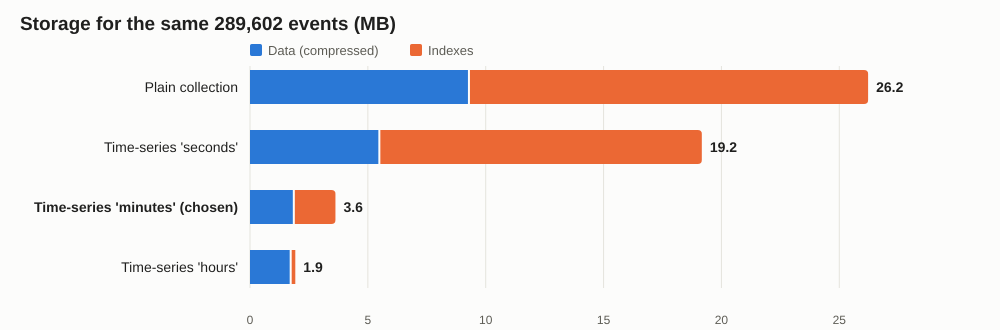
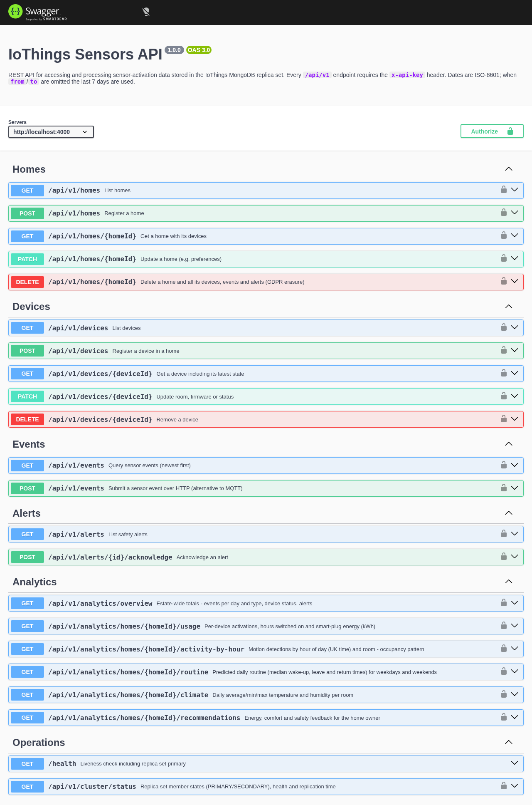
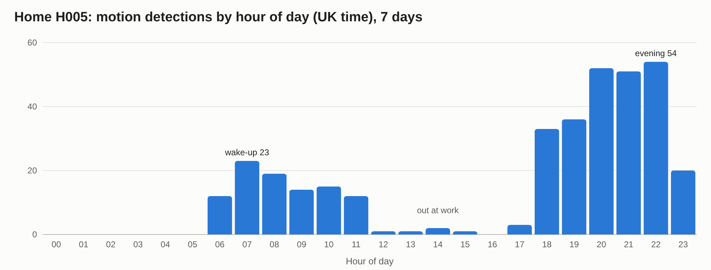

# IoThings Sensors Database

**Design, Implementation and Evaluation of a Distributed MongoDB Data Store for Home-Automation Sensor Data**

| | |
|---|---|
| **Prepared for** | IoThings Home Automation Solutions Ltd (UK SME) |
| **Prepared by** | _[Your name]_, consultant data scientist / programmer / analyst |
| **Date** | September 2026 |
| **Version** | 1.0 |
| **Project repository** | `iothings/` (source code, scripts, dataset generator, README) |

---

## Executive Summary

IoThings installs sensors that automate homes and report their activity over MQTT. The company already runs relational systems for ERP, CRM, finance, order processing and logistics. It now needs a data store that can absorb a continuous stream of sensor activations, keep that data safe, and turn it into feedback for home owners. This report explains the principal types of NoSQL database, critically compares the relational and document-store approaches, and then presents a working, tested implementation for IoThings.

**What was built.** A three-member MongoDB 7 replica set, secured with keyfile authentication and role-based access control. An authenticated Eclipse Mosquitto MQTT broker. A Node.js ingest service that validates each sensor message, raises safety alerts and writes events in batches. A documented REST API with create/read/update/delete operations and six analytics endpoints. A reproducible synthetic dataset: 20 homes, 480 devices and 289,602 events over 30 days.

**Key measured results:**

| Test | Result |
|---|---|
| Failover (primary killed, 5 runs) | New primary elected in 10–16 s (mean 13.4 s); writes succeeded throughout |
| End-to-end ingest throughput | 47,393 events/s stored with majority write concern (100,000-message burst) |
| Storage after time-series tuning | 5.8 MB for 289,602 events, down from 131 MB (a 22× reduction) |
| Typical API response time | 3–12 ms for per-home queries and analytics |

Testing also found and fixed a real defect. At default settings, the MQTT broker silently dropped up to 93% of messages during a burst.

**Recommendation.** IoThings should adopt MongoDB for sensor data **alongside**, not instead of, its relational systems ("polyglot persistence"). The replica set delivers the high availability the company asked for, the time-series collection keeps storage costs low, and the flexible document model lets new device types be added without schema migrations. Before production, the priorities are TLS encryption, deploying the three members on separate servers, and per-customer API authentication.

---

## Contents

1. Introduction
2. Principal Types of NoSQL Databases
3. Critical Comparison: Relational Databases and Document Stores
4. IoThings NoSQL Database Design and Implementation
5. API Implementation and Documentation
6. Summary and Conclusion
7. References
- Appendix A: Dataset Used for Testing
- Appendix B: Test Data and Procedures
- Appendix C: Unit Tests
- Appendix D: Reproducing the Results

**List of figures**

1. Overall system architecture
2. Replica set configuration and status
3. Collections, time-series options and indexes
4. Example document from each collection
5. Storage for the same events under four designs
6. Role-based access control test
7. MQTT safety alert and message validation
8. CRUD, aggregation and index-usage demonstration
9. Failover test output
10. Swagger UI API documentation
11. Example API responses
12. Occupancy pattern derived by the API

---

## 1. Introduction

IoThings Home Automation Solutions is a UK start-up that fits homes with smart sensors and actuators: door locks and contacts, lights and switches, motorised blinds, thermostats, temperature and humidity sensors, motion detectors, smoke alarms and smart plugs. Each device reports its activations as MQTT messages. IoThings wants to use this data for three purposes:

- to **predict household activity**, for example when occupants wake, leave and return
- to **recommend changes** to owners, for example on energy use and comfort
- to **keep homes and occupants safe**, for example by sending a notification when a smoke alarm triggers or a door is unlocked at night

The company's existing systems (ERP, CRM, financial, order processing/sales and logistics) are relational. They suit structured, transactional business records, but not a high-volume, append-only stream of time-stamped sensor readings from many device types. IoThings has asked for a new NoSQL core database for sensor-activation data. It has also asked for:

- a "three cluster" MongoDB system, because it is concerned about data security and availability
- a simple Node.js server that receives MQTT messages and stores them in MongoDB
- an API for accessing and processing the stored data

As agreed, the scope is the **sensors database** only. The company's real data is protected by UK GDPR, so all testing uses a synthetic dataset built to mimic real household behaviour (section 4.7 and Appendix A).

The rest of this report is organised as follows:

- **Section 2** explains the four principal types of NoSQL database and the theory behind them.
- **Section 3** critically compares relational databases with document stores in general terms, so that IoThings can apply the analysis to any vendor.
- **Section 4** presents the design, installation, configuration and testing of the MongoDB system, including measured performance and failover results.
- **Section 5** documents the REST API.
- **Section 6** concludes with a recommendation, the limitations and future work.


---

## 2. Principal Types of NoSQL Databases

### 2.1 What "NoSQL" means and why it emerged

"NoSQL" is best read as **"Not Only SQL"**. It is an umbrella term for databases that do not use the relational table model as their primary way of storing data (Sadalage and Fowler, 2012). It does not reject SQL or relational ideas. Many NoSQL products now offer SQL-like query languages, secondary indexes and ACID transactions. NoSQL systems grew from the needs of large web companies in the 2000s. Google's Bigtable (Chang et al., 2006) and Amazon's Dynamo (DeCandia et al., 2007) were built for data volumes and availability targets that a single relational server could not meet economically. Three pressures drove the movement (Cattell, 2011):

1. **Scale.** Spreading data and load across many cheap servers ("scaling out") instead of buying ever larger single machines ("scaling up").
2. **Variety.** Storing data whose structure differs between records or changes often, without costly schema migrations.
3. **Availability.** Continuing to accept reads and writes when individual servers or network links fail.

NoSQL databases are usually grouped into four families. Each makes different trade-offs, and the right choice depends on how the data will be accessed.

### 2.2 Key-value stores

A key-value store is the simplest model: a very large distributed hash table. Each item is an opaque value (a string, number or binary object) stored and retrieved by a unique key. Examples include Redis, Amazon DynamoDB and Riak. Dynamo showed how such a store can remain writable during failures by replicating each key across several nodes and resolving conflicts later (DeCandia et al., 2007).

- **Strengths:** extremely fast lookups by key (often sub-millisecond); straightforward horizontal partitioning; a simple programming interface; ideal for caching and session state.
- **Weaknesses:** the database cannot query or index inside the value, so questions such as "all devices in Birmingham" need extra structures maintained by the application; relationships between items are not supported.
- **Relevance to IoThings:** a good fit for a cache of each device's latest state, or for per-device rate limiting. It is unsuitable as the main analytical store.

### 2.3 Document stores

A document store also stores items under a key, but the value is a **structured, self-describing document**, usually JSON or a binary equivalent such as MongoDB's BSON. Documents can contain nested objects and arrays. Because the database understands their structure, it can index and query any field. Examples include MongoDB, Couchbase and Amazon DocumentDB.

- **Strengths:**
  - A document maps naturally onto objects in application code, so no object-relational mapping layer is needed.
  - Related data that is read together can be stored together, avoiding joins.
  - The schema is flexible: documents in one collection can differ, which suits evolving products.
  - Queries and aggregations are rich, and replication and sharding are built in.
- **Weaknesses:**
  - Data is often duplicated (denormalised) for read speed, so the application must keep the copies consistent.
  - Relationships between many entities (many-to-many joins) are less natural than in SQL.
  - Flexibility can lead to inconsistent data unless schema validation is applied.
- **Relevance to IoThings:** a strong fit. A sensor message is already a small JSON document, the eleven device types report different fields, and new device types can be added without altering existing data. This is the model implemented in section 4.

### 2.4 Wide-column (column-family) stores

Wide-column stores, derived from Bigtable (Chang et al., 2006), organise data into rows identified by a key. Each row holds a flexible, possibly very large set of columns grouped into column families, and data is stored sorted by row key. Apache Cassandra (Lakshman and Malik, 2010) and HBase are the best-known examples.

- **Strengths:** outstanding write throughput and linear scalability across many nodes and data centres; efficient range scans when the row key is designed around the query (for example "device ID + time"); tunable consistency.
- **Weaknesses:** tables must be designed around known query patterns, and a new question often needs a new table; ad-hoc queries, aggregations and secondary indexes are limited; operations and data modelling are complex.
- **Relevance to IoThings:** a credible alternative for very large telemetry volumes (millions of devices). At IoThings' current scale, its rigidity and operational cost outweigh its throughput advantage.

### 2.5 Graph databases

Graph databases store **nodes** (entities) and **edges** (relationships), each of which can carry properties. Relationships are first-class data, so traversing them ("friends of friends", "which devices share a gateway") takes roughly constant time per step, rather than the growing join cost seen in relational systems (Robinson, Webber and Eifrem, 2015; Angles and Gutierrez, 2008). Examples include Neo4j and Amazon Neptune.

- **Strengths:** natural modelling of highly connected data; efficient multi-step traversals; expressive graph query languages such as Cypher.
- **Weaknesses:** less suited to bulk aggregation over large volumes of simple records; horizontal scaling is harder because graphs are difficult to partition; the ecosystem is smaller.
- **Relevance to IoThings:** potentially useful in future for modelling relationships between homes, rooms, devices and automation rules. It is not appropriate for the time-series event stream.

### 2.6 Underlying theory

**CAP theorem.** Brewer conjectured, and Gilbert and Lynch (2002) proved, that when a network **partition** (P) occurs, a distributed data store must choose between **consistency** (C: every read sees the latest write) and **availability** (A: every request receives a response). Brewer (2012) later clarified that the choice arises only during a partition, and that systems can make it differently for different operations.

**PACELC.** Abadi (2012) extended CAP: *if* there is a Partition, choose Availability or Consistency; *Else*, choose Latency or Consistency. This matters more in day-to-day operation, because replicating every write synchronously improves consistency but adds latency. Abadi (2012) placed MongoDB in the PA/EC class. In practice its position depends on configuration: during a partition, only the side holding a majority can elect a primary and accept writes, and with majority write concern and primary reads it behaves consistently. The balance is tuned through **write concern** and **read preference**, as section 4 shows.

**ACID and BASE.** Relational databases guarantee **ACID** transactions: Atomicity, Consistency, Isolation and Durability (Haerder and Reuter, 1983). Many early NoSQL systems relaxed these guarantees in favour of **BASE**: Basically Available, Soft state, Eventually consistent (Pritchett, 2008). Here replicas may briefly disagree but converge over time. The distinction has blurred. MongoDB has supported multi-document ACID transactions since version 4.0, and several relational systems now scale horizontally.

**Scaling mechanisms.** NoSQL systems scale with two techniques:

- **Replication** keeps copies of the same data on several servers. It provides redundancy and extra read capacity.
- **Sharding** (partitioning) divides the data across servers by a key. It provides write capacity and storage beyond one machine.

Replication in MongoDB uses an elected primary and a Raft-style consensus protocol (Zhou et al., 2021; Ongaro and Ousterhout, 2014).

**Table 1: Summary of the four NoSQL types**

| Type | Data model | Examples | Main strengths | Main weaknesses | Fit for IoThings |
|---|---|---|---|---|---|
| Key-value | Key → opaque value | Redis, DynamoDB, Riak | Fastest lookups; simple scaling | No queries inside values; no relationships | Device-state cache |
| Document | Key → JSON/BSON document | MongoDB, Couchbase | Flexible schema; rich queries; objects map directly | Duplication; weaker many-to-many | **Main sensor store (chosen)** |
| Wide-column | Row key → column families | Cassandra, HBase | Massive write throughput; multi-data-centre | Query-driven design; limited ad-hoc queries | Future option at very large scale |
| Graph | Nodes + edges | Neo4j, Neptune | Fast relationship traversal | Harder to scale; poor at bulk aggregation | Future device/rule relationships |

---

## 3. Critical Comparison: Relational Databases and Document Stores

This section is deliberately generic. It compares the relational model with document stores as a class, so that its conclusions still hold if IoThings chooses a vendor other than MongoDB.

### 3.1 Data model and schema

A relational database stores data in tables whose structure is declared in advance (Codd, 1970). **Normalisation** stores each fact once and links tables with foreign keys. The fixed schema is a strong guarantee: every row has the declared columns, with the declared types and constraints. The cost is rigidity. Adding a new sensor type with new attributes means altering tables or adding sparse, mostly empty columns, and schema migrations on large tables can be slow and risky.

A document store is **schema-flexible**. Each document carries its own structure, so a thermostat reading and a door-lock event can sit in the same collection with different fields. This speeds up development and suits heterogeneous IoT data. The risk is that "schema-less" becomes "schema-chaotic", with misspelt fields and wrong types accumulating silently. The mitigation is optional schema validation in the database, used in this project (section 4.5). With validation, flexibility is kept where it helps and structure is enforced where it matters.

**Evaluation:** the relational model wins where data structure is stable and integrity is paramount, as in IoThings' financial and order data. The document model wins where structure varies and evolves, as in sensor payloads.

### 3.2 Relationships and joins

Relational databases excel at relationships. Joins can combine any tables at query time, so they answer questions nobody anticipated when the schema was designed. Document stores favour **embedding** related data inside a document when it is read together, and **referencing** it (storing an identifier) when it is large, shared or updated independently. Embedding removes joins and makes reads fast. Referencing requires either several queries or a lookup operation such as MongoDB's `$lookup`, which is generally less optimised than a relational join. The document model therefore demands **query-driven design**: the designer must know the main access patterns in advance (Sadalage and Fowler, 2012).

**Evaluation:** for highly interrelated business data (customers, orders, invoices, stock), relational joins are a genuine advantage. For sensor events, which are almost always read by device or home over a time range, the access pattern is known and narrow, so the document model's weakness costs little.

### 3.3 Transactions and consistency

Relational databases provide full ACID transactions across any number of rows and tables. This is essential when, for example, an order and a stock movement must both succeed or both fail. Document stores traditionally guaranteed atomicity only within a single document, on the reasoning that a well-designed document contains everything that must change together. Modern document stores, including MongoDB, now offer multi-document ACID transactions, but these are slower and are not the intended default pattern. In a replicated document store, consistency is **tunable**. The application chooses how many replicas must acknowledge a write (write concern) and which replicas may serve reads (read preference). Stronger settings cost latency, as PACELC predicts.

**Evaluation:** strict, multi-entity transactional integrity remains the relational model's strongest argument. Sensor events are independent, append-only facts, so single-document atomicity with majority-acknowledged writes gives all the durability they need.

### 3.4 Scalability and availability

Relational databases were designed for a single server and traditionally **scale vertically** with a bigger machine. Replication for read scaling and failover is mature, but spreading writes across many servers usually needs application-level sharding or specialist products. Document stores were designed to **scale horizontally**. Replication with automatic failover and hash- or range-based sharding are built in (Cattell, 2011). The trade-off is operational complexity: a cluster has more moving parts to monitor, and a poor shard key can create hot spots.

**Evaluation:** sensor data grows with every home installed and every hour that passes, while business data grows much more slowly. The ingest workload benefits most from horizontal scaling and automatic failover.

### 3.5 Query language, tooling and skills

SQL is an international standard, used for five decades, with a huge ecosystem of reporting tools, trained staff and literature. Document stores use product-specific query APIs. MongoDB's aggregation pipeline is powerful, with windowing, time bucketing and statistical operators such as median, but the skills do not transfer directly between vendors. This creates a degree of **vendor lock-in** and a training cost. Business-intelligence tools also connect to SQL databases more readily.

**Evaluation:** this is a genuine cost for a small company. It is mitigated by exposing sensor data through a stable REST API (section 5), so most consumers never touch the query language.

### 3.6 Performance for time-series writes

Relational databases handle insert-heavy workloads adequately, but every row carries per-row overhead, and every index must be updated on each insert. General-purpose tables do not compress repetitive time-stamped data well. Document stores, and especially dedicated time-series collections, group measurements from the same source into compressed **buckets**. Section 4.10 measures the effect in this project. For the same 289,602 events, a plain collection used 26.2 MB, while a tuned time-series collection used 3.6 MB.

### 3.7 NoSQL extends rather than replaces SQL

The most important conclusion of this comparison is that the two approaches are **complementary**. Fowler (2011) calls the practice of choosing the store that fits each workload **polyglot persistence**, and Stonebraker (2010) warns against treating NoSQL as a universal replacement. IoThings should keep its ERP, CRM, financial, sales and logistics data relational, where ACID transactions and ad-hoc joins matter. It should add a document store for high-volume, variably structured sensor data, where flexible schema, compression and horizontal scaling matter. The two are linked by a customer reference (`customerRef`), so no personal data needs to be copied into the new store.

**Table 2: Relational databases compared with document stores**

| Criterion | Relational | Document store | Evaluation for IoThings |
|---|---|---|---|
| Schema | Fixed, declared in advance; strong integrity | Flexible per document; optional validation | Document store for varied sensor payloads; relational for business records |
| Relationships | Joins across any tables; ad-hoc queries | Embed or reference; `$lookup` for joins | Sensor access patterns are narrow and known, so the join weakness costs little |
| Transactions | Full multi-table ACID | Single-document atomic; multi-document ACID available but costly | Relational for orders and finance; single-event atomicity is enough for sensors |
| Consistency | Strong by default | Tunable (write concern, read preference) | Majority writes give durability without much latency cost |
| Scalability | Vertical; horizontal is harder | Horizontal replication and sharding built in | Sensor data grows fastest, so scale-out matters |
| Query language | Standard SQL; vast ecosystem | Vendor-specific APIs and pipelines | Hide behind a REST API to limit lock-in |
| Time-series writes | Per-row and per-index overhead | Bucketed, compressed time-series collections | 7× smaller than a plain collection (section 4.10) |
| Maturity and skills | Very mature; skills plentiful | Mature but younger; skills rarer | Training cost is modest for one bounded workload |

---

## 4. IoThings NoSQL Database Design and Implementation

### 4.1 Requirements

The requirements below were derived from the brief. Each is traced to its evidence later in this report.

| # | Requirement | Where it is met |
|---|---|---|
| R1 | Store sensor-activation data received as MQTT messages | 4.6, Figure 7 |
| R2 | A "three cluster" MongoDB system for security and availability | 4.3, 4.9, Figures 2 and 9 |
| R3 | Protect the data (security, UK GDPR) | 4.4, Figure 6 |
| R4 | Support prediction, recommendations and safety notifications | 4.6, 5.3, Figures 11 and 12 |
| R5 | A Node.js server to handle MQTT messages | 4.6 |
| R6 | An API to access and process stored data | Section 5, Figure 10 |
| R7 | Test data, CRUD and distributed data management demonstrated | 4.7–4.9, Appendices A and B |

### 4.2 Technology choices

| Component | Choice (version tested) | Justification |
|---|---|---|
| Database | MongoDB Community 7.0.43, replica set `rs0` | A document model matching JSON sensor messages; native time-series collections; built-in replication, failover and RBAC |
| Message broker | Eclipse Mosquitto 2.1.2 | A lightweight, widely used open-source MQTT broker with password authentication |
| Server runtime | Node.js 22.23.3 | Named in the brief; event-driven I/O suits many small concurrent messages |
| Libraries | MongoDB Node driver 6.21, MQTT.js 5.16, Express 4.22 | Official or de facto standard libraries |
| API documentation | OpenAPI 3.0 with Swagger UI | An industry-standard, machine-readable, interactive specification |
| Deployment | Docker Compose (Docker 29.8) | The whole system starts with one command and behaves the same on any machine |

All tests ran on one workstation (Intel Core i7-13700, 24 threads, 32 GB RAM). Section 6.1 discusses how running all three members on one host affects interpretation of the results.

### 4.3 Installation and configuration of the three-member replica set

A MongoDB **replica set** is a group of `mongod` servers that hold the same data. One member is the **primary** and accepts all writes, recording each change in an operations log (the **oplog**). The other members are **secondaries**: they continuously copy and replay the primary's oplog. Members exchange heartbeats every two seconds. If the primary becomes unreachable (by default for more than 10 seconds), the remaining members hold an **election**, and a secondary with an up-to-date copy becomes the new primary. An election needs votes from a **majority** of members. Three members is therefore the smallest configuration that survives the loss of any one server: the other two still form a majority (2 of 3). This is what the client's "three cluster" request should mean in practice.

The cluster is defined in `docker-compose.yml`. Each member runs the same command:

```
mongod --replSet rs0 --bind_ip_all --port <27017|27018|27019> --keyFile /etc/mongo-keyfile
```

**Table 3: Replica set members**

| Member | Host:port | Priority | Votes | Intended role |
|---|---|---|---|---|
| mongo1 | mongo1:27017 | 2 | 1 | Preferred primary |
| mongo2 | mongo2:27018 | 1 | 1 | Secondary |
| mongo3 | mongo3:27019 | 1 | 1 | Secondary |

`mongo1` has a higher **priority**. After any failover, once it has caught up, it takes back the primary role, which keeps the topology predictable for operations staff.

A single script, `scripts/setup.sh`, performs the installation. It is safe to run more than once:

1. Generates random passwords and an API key into a `.env` file, which is excluded from version control.
2. Generates the replica set **keyfile**, a shared secret that members use to authenticate each other.
3. Creates the Mosquitto password file.
4. Starts the three `mongod` containers and the broker, then waits for their health checks.
5. Runs `rs.initiate()` with the configuration in Table 3 (`mongo/01-init-replica-set.js`).
6. Creates the administrator and application users (`mongo/02-create-users.js`).
7. Creates the collections, validators and indexes (`mongo/03-create-schema.js`).
8. Builds and starts the ingest service and the API.

```
--- rs.conf()
mongo1:27017   priority=2 votes=1
mongo2:27018   priority=1 votes=1
mongo3:27019   priority=1 votes=1
writeConcernMajorityJournalDefault=true
--- rs.status()
mongo1:27017   PRIMARY    health=1 optime=2026-09-30T11:06:04.000Z
mongo2:27018   SECONDARY  health=1 optime=2026-09-30T11:06:04.000Z
mongo3:27019   SECONDARY  health=1 optime=2026-09-30T11:06:04.000Z
```
*Figure 2: Replica set configuration and status, captured from `mongosh`. All three members are healthy and have identical optimes, meaning the secondaries are fully up to date.*

**Write and read settings.** The Node.js applications connect with a replica-set connection string listing all three members, plus the following options:

- `writeConcern: { w: 'majority' }`: a write is acknowledged only after it is on at least two of the three members. An acknowledged sensor event therefore survives the loss of the primary.
- `retryWrites` and `retryReads`: the driver transparently retries an operation once if an election interrupts it.
- `readPreference: 'primaryPreferred'`: reads normally go to the primary (strongly consistent), but can fall back to a secondary during an election, so dashboards keep working.

### 4.4 Security design

Security was designed in layers, so that no single failure exposes the data.

**Table 4: Security measures**

| Layer | Measure | Threat addressed |
|---|---|---|
| Between cluster members | Keyfile authentication (`--keyFile`) | A rogue server joining the replica set |
| Database access | Authentication required; **role-based access control** with least privilege (Table 5) | Stolen application credentials being used for more than their purpose |
| MQTT broker | `allow_anonymous false`; hashed password file; separate `ingest` and `gateway` accounts | Unauthenticated devices injecting fake sensor data |
| Message content | Every message checked against the device registry and per-type rules (4.6) | Malformed or spoofed data corrupting analytics |
| Database content | `$jsonSchema` validators on `homes`, `devices` and `alerts` | Invalid documents from any client |
| REST API | `x-api-key` header compared in constant time; 100 KB body limit; clients can write only listed fields; internal errors hidden from clients | Unauthorised access, oversized payloads, mass-assignment, information leakage |
| UK GDPR | Personal data stays in the CRM (only `customerRef` is stored); events expire after 2 years (TTL); one API call erases all of a home's data | Storage limitation and the right to erasure (ICO, 2023) |
| Secrets | Generated per installation; excluded from source control | Credentials leaked through the code repository |

**Table 5: Database users and roles**

| User | Roles | Used by |
|---|---|---|
| `admin` | `root` | Setup and administration only |
| `iothings_ingest` | `readWrite` on `iothings` | MQTT ingest service |
| `iothings_api` | `readWrite` on `iothings`, `clusterMonitor` | REST API (the monitor role serves `/cluster/status`) |
| `iothings_analyst` | `read` on `iothings` | Analysts and reporting tools |

```
connected as: [{"user":"iothings_analyst","db":"iothings"}]
read homes: 20 documents
delete refused: Unauthorized - not authorized on iothings to execute command { delete: "homes", ... }
```
*Figure 6: Role-based access control test (`mongo/demo-rbac.js`). The read-only analyst account can query data, but MongoDB refuses its attempt to delete every home.*

**Limitations.** Traffic is not yet encrypted with TLS, and data is not encrypted at rest. Both are essential before production, and both are supported by MongoDB, Mosquitto and Node.js without code changes (section 6.2).

### 4.5 Data model

The database `iothings` contains four collections. The design follows the document-modelling principle of structuring data around how it will be queried (Sadalage and Fowler, 2012).

**Table 6: Collections**

| Collection | Kind | Contents | Indexes |
|---|---|---|---|
| `homes` | Validated | One document per property: address, rooms, owner preferences (target temperature, night hours, notification contacts) and `customerRef` linking to the CRM | `homeId` (unique), `customerRef`, `address.postcode` |
| `devices` | Validated | One document per installed device: type (one of 11), room, manufacturer, model, firmware, status, plus a copy of its latest state | `deviceId` (unique), `{homeId, type}` |
| `sensor_events` | **Time-series** (`timeField: ts`, `metaField: meta`, granularity `minutes`, 730-day TTL) | One entry per activation | `{meta.homeId, ts}`, `{meta.deviceId, ts}`, `{meta.type, ts}` |
| `alerts` | Validated | Safety alerts: kind, severity, message, time, acknowledgement | `{homeId, acknowledged, ts}`, `{severity, ts}` |

```
homes          type=collection validator=yes
devices        type=collection validator=yes
alerts         type=collection validator=yes
sensor_events  type=timeseries {"timeField":"ts","metaField":"meta","granularity":"minutes",
               "bucketMaxSpanSeconds":86400} expireAfterSeconds=63072000
--- sensor_events indexes
{"meta":1,"ts":1}  {"meta.homeId":1,"ts":-1}  {"meta.deviceId":1,"ts":-1}  {"meta.type":1,"ts":-1}
```
*Figure 3: Collections and time-series options reported by `db.getCollectionInfos()` and `getIndexes()`. The expiry of 63,072,000 seconds is 730 days.*

```js
// homes
{ homeId: 'H005', customerRef: 'CRM-10005', name: 'Sheffield home 5',
  address: { line1: '16 Victoria Road', city: 'Sheffield', postcode: 'S28 7HR' },
  rooms: ['hallway', 'living_room', 'kitchen', 'bedroom', 'bathroom'],
  preferences: { targetTemperature: 20.5, nightStart: '22:30', nightEnd: '06:30',
                 notifyContacts: ['owner5@example.com'] },
  profile: 'commuter', createdAt: ISODate('2026-08-24T00:00:00Z') }
// devices
{ deviceId: 'H005-hallway-door-lock', homeId: 'H005', type: 'door_lock', room: 'hallway',
  manufacturer: 'Nuki', model: 'DOO-706', firmware: '3.5.3', status: 'active',
  installedAt: ISODate('2026-08-24T00:00:00Z'),
  lastSeen: ISODate('2026-09-29T22:22:19Z'), lastState: { state: 'locked' } }
// sensor_events
{ ts: ISODate('2026-09-29T22:22:19.279Z'),
  meta: { homeId: 'H005', deviceId: 'H005-hallway-door-lock', room: 'hallway', type: 'door_lock' },
  state: 'locked' }
// alerts
{ homeId: 'H001', deviceId: 'H001-kitchen-smoke-alarm', ts: ISODate('2026-09-16T17:31:56Z'),
  kind: 'smoke', severity: 'critical', message: 'Smoke detected in kitchen', acknowledged: false }
```
*Figure 4: An example document from each collection, as stored.*

**Design decisions:**

1. **A time-series collection for events.** Time-series collections (MongoDB 5.0 and later) store measurements from the same `meta` value (here, one device) in compressed buckets covering a time window. This cuts storage and speeds up time-range queries, which are the dominant access pattern. The granularity was chosen by experiment (section 4.10).
2. **Devices are referenced, not embedded in homes.** A home has many devices, device state changes constantly, and devices are queried on their own. Embedding them would make every state update rewrite the whole home document. `GET /homes/{id}` joins the two with `$lookup` when both are needed.
3. **Deliberate duplication of `lastState`.** Each device document carries a copy of its most recent reading. A dashboard can therefore show the current state of every device in a home with one indexed query instead of scanning events. This trades a small write cost for a large read saving, a typical document-store choice.
4. **Denormalised `meta` on each event.** Each event repeats its home, room and type alongside the device ID. Queries such as "all motion in home H005" then need no join, and all four fields help the time-series engine group and compress the data.
5. **A link to the CRM rather than a copy of it.** Only `customerRef` is stored. Names, emails and payment details stay in the relational CRM, which keeps personal data to a minimum in the new store (UK GDPR data minimisation) and avoids two copies drifting apart.
6. **Validation where the structure is known.** `homes`, `devices` and `alerts` have `$jsonSchema` validators (required fields, enumerated device types, value ranges, ID patterns). Payload rules for events are applied in the ingest service, because the rules depend on the device type.

### 4.6 MQTT ingest service

The ingest service (`src/ingest.js`) connects to the broker with its own credentials. It subscribes to `iothings/+/+/state` at **QoS 1** (at-least-once delivery) with a **persistent session**, so the broker queues messages while the service restarts. Devices publish JSON to `iothings/<homeId>/<deviceId>/state`, for example `{"state":"on","value":80}` for a light at 80% brightness.

For each message the service:

1. **Parses the topic.** It rejects topics that do not match the pattern.
2. **Looks up the device** in `devices`, with a 60-second in-memory cache. It rejects unknown devices and devices that belong to a different home. This stops a compromised gateway from writing into another customer's data.
3. **Validates the payload** against the rules for the device type. For example, a door lock may only be `locked` or `unlocked`, a temperature must lie between −20 and 60 °C, and a battery level between 0 and 100.
4. **Builds the event document**, adding the device's home, room and type as `meta`.
5. **Evaluates the safety rules:**
   - smoke detected produces a **critical** alert
   - a door unlocked or opened during the owner's night hours produces a **warning**; night hours are evaluated in UK local time, so the rule stays correct across the change to British Summer Time
   - a temperature of 35 °C or more, or 5 °C or less, produces a **warning**

   Each alert is stored at once and published to `iothings/<homeId>/notifications`, so apps and gateways can notify the owner.
6. **Buffers the event** and writes the buffer with one `insertMany` when it holds 500 events or every second, whichever comes first. It then updates each affected device's `lastState`.

Batching turns thousands of small writes, each waiting for acknowledgement from two replicas, into a few large ones. This is the main reason for the throughput measured in section 4.10.

```
$ simulator.js --smoke H007
published smoke event for H007-hallway-smoke-alarm
notification received on iothings/H007/notifications {"homeId":"H007",
  "deviceId":"H007-hallway-smoke-alarm","kind":"smoke","severity":"critical",
  "message":"Smoke detected in hallway", ...}

$ simulator.js --invalid          (ingest service log)
ALERT critical Smoke detected in hallway H007
rejected iothings/H001/H001-living-room-temperature/state value 999 outside -20..60
rejected iothings/H001/H001-living-room-temperature/state invalid state "banana" for temperature
rejected non-JSON message on iothings/H001/H001-living-room-temperature/state
rejected message from unregistered device iothings/H001/UNKNOWN-DEVICE/state
```
*Figure 7: Top: a smoke event travels from the device through the broker, ingest service and alert rules, and back to the home as a notification. Bottom: four deliberately invalid messages are all rejected and logged.*

### 4.7 Test dataset

IoThings cannot share customer data because of UK GDPR, so a dataset was generated from a **behavioural model** (`src/behaviour.js`) instead of random values. The model simulates each home's daily routine in UK local time. Commuters, remote workers and shift workers wake, leave and return at different times, and weekends differ from weekdays. The model also covers:

- motion and lights following occupants from room to room
- a kettle and a TV on smart plugs
- blinds that open in the morning and close in the evening
- heating cycles, with room temperature responding to the thermostat
- humidity peaks after showers
- monthly smoke-alarm tests, occasional burnt dinners (smoke) and occasional late-night door use

A seeded random-number generator makes the dataset **exactly reproducible**. Every generated message passes through the same validation and alert rules as live traffic.

| Item | Value |
|---|---|
| Homes | 20, in 8 UK cities; 9 commuter, 7 remote-worker and 4 shift-worker profiles |
| Devices | 24 per home across 5 rooms; 480 in total; 11 types |
| Period | 30 days (31 August to 29 September 2026) |
| Events | 289,602 (0 rejected) |
| Alerts raised | 64 (22 smoke, 21 night-time door opened, 21 night-time door unlocked) |

Because the ground truth is known, the dataset can also **validate the analytics**. Section 5.3 shows that the API recovers the behaviour that the model was given. Appendix A gives the full breakdown.

### 4.8 Data management: CRUD and queries

`mongo/demo-queries.js` demonstrates the full data lifecycle as the `iothings_api` user.

```
==== CREATE - register a new home and a device ====
{ homeId: 'H900', customerRef: 'CRM-19900', name: 'Demo home', ... }
==== CREATE - schema validation rejects a bad document ====
rejected: Document failed validation            <- device type 'toaster' not allowed
==== READ - latest 5 events for the H001 front door lock ====
{ ts: ISODate('2026-09-29T22:19:37.198Z'), state: 'locked' }
{ ts: ISODate('2026-09-28T21:45:26.387Z'), state: 'locked' }  ... (5 documents)
==== UPDATE - change preferences and mark a device faulty ====
{ acknowledged: true, matchedCount: 1, modifiedCount: 1 }   (x2)
==== AGGREGATE - average living-room temperature by hour of day (UK time) ====
06:00  15.8°C  #####
07:00  16.7°C  ########          <- heating starts before wake-up
 ...
21:00  20.1°C  ##################
==== INDEX USAGE - explain() for a per-device time-range query ====
indexes used: "indexName":"meta.deviceId_1_ts_-1"
==== DELETE - remove the demo home (GDPR erasure across collections) ====
{ homes: 1, devices: 1, events: 1 }
```
*Figure 8: A condensed CRUD, aggregation and index-usage demonstration. Schema validation blocks an invalid device, and `explain()` confirms the per-device query uses the compound index rather than a collection scan.*

### 4.9 Distributed data management: failover test

The most important property of the three-member design is that it keeps working when a server fails. `scripts/failover-demo.sh` tests this in five steps:

1. It kills the primary's container abruptly (`docker kill`, simulating a crash rather than a clean shutdown).
2. It measures how long the survivors take to elect a new primary.
3. It writes an event through the API while one member is down.
4. It restarts the failed member.
5. It observes that member rejoining and taking back the primary role.

```
1. Current replica set
    mongo1:27017   PRIMARY                  health=1
    mongo2:27018   SECONDARY                health=1
    mongo3:27019   SECONDARY                health=1
2. Simulating a crash of the primary: docker kill mongo1
3. Waiting for the remaining members to elect a new primary
    new primary mongo3:27019 elected after 16s
    mongo1:27017   (not reachable/healthy)  health=0
    mongo3:27019   PRIMARY                  health=1
4. Writes still succeed with one node down (w: majority = 2 of 3)
    POST /events -> HTTP 201
5. Restarting mongo1 - it rejoins as SECONDARY and catches up from the oplog
    mongo1:27017   SECONDARY                health=1
6. mongo1 has priority 2, so once it has caught up it is re-elected primary
    mongo1:27017   PRIMARY                  health=1
```
*Figure 9: Failover test output (one of five runs).*

**Table 7: Failover results over five runs**

| Run | 1 | 2 | 3 | 4 | 5 | Mean |
|---|---|---|---|---|---|---|
| Time to new primary (s) | 10 | 16 | 15 | 10 | 16 | **13.4** |
| Write with one member down | 201 | 201 | 201 | 201 | 201 | 5/5 succeeded |
| Failed member rejoined and resynced | ✓ | ✓ | ✓ | ✓ | ✓ | 5/5 |

**Analysis:**

- **Where the time goes.** The failover time is dominated by MongoDB's default election timeout of 10 seconds: the survivors must first decide the primary is really gone. The time also includes the script's one-second polling interval.
- **Tuning.** Lowering `settings.electionTimeoutMillis` would shorten failover, at the risk of unnecessary elections on a congested network. That is a CAP/PACELC trade-off in practice.
- **No data loss.** During the gap, the ingest service holds events in its buffer and retries, and QoS 1 with a persistent session means the broker keeps undelivered messages. Every write acknowledged with `w: majority` was already on the surviving majority, so no acknowledged data could be lost.
- **Recovery.** When the failed member returned, it caught up from the new primary's oplog without manual intervention.

### 4.10 Performance evaluation and tuning

Two experiments were run to check that the design performs well and to find weaknesses before IoThings relies on it.

#### 4.10.1 Time-series granularity

The first version of the schema used granularity `seconds`. With this setting, MongoDB closes a bucket after at most one hour. Most IoThings devices report only a few times an hour: temperature every 15 minutes, a door lock a few times a day. Measured storage statistics showed **92,168 buckets holding on average about three events each**. That is far too few for effective compression, and every bucket needs its own index entries. To quantify the effect, the same 289,602 events were copied into three time-series variants and a plain collection, each with identical indexes. The script is `mongo/benchmark-granularity.js`.

**Table 8: Storage and query cost for the same 289,602 events**

| Design | Buckets | Data (KB) | Indexes (KB) | Device/day query: units read, ms | Home/day query: units read, ms | 7-day aggregation (ms) |
|---|---|---|---|---|---|---|
| Plain collection | – | 9,468 | 17,384 | 96, 1.1 | 474, 1.6 | 2.6 |
| Time-series `seconds` | 92,168 | 5,576 | 14,052 | 24, 1.1 | 157, 2.1 | 1.8 |
| **Time-series `minutes`** | **11,480** | **1,860** | **1,852** | **2, 0.8** | **40, 1.8** | **0.8** |
| Time-series `hours` | 635 | 1,724 | 244 | 1, 0.8 | 21, 2.9 | 0.8 |

*"Units read" means buckets examined for time-series collections and documents examined for the plain collection.*



**Findings:**

- **Time-series beats a plain collection.** It is 1.4× smaller with `seconds` and about 7× smaller with `minutes`.
- **Granularity matters more than the choice of time-series itself.** Moving from `seconds` to `minutes` gives buckets of up to 24 hours per device. That cut buckets by 88% and total storage by 81%, and reduced the buckets read for a one-device, one-day query from 24 to 2.
- **`hours` is not better despite being smallest.** Its buckets can span up to 30 days, so a query for one day of a whole home must decompress much more data than it returns. The home/day query was the slowest of the time-series variants (2.9 ms), and the gap would widen with more data.
- **Query times are similar at this scale.** They all sit between 0.8 and 2.9 ms, so storage and I/O efficiency, which grow with data volume, are the deciding factors.

**Decision:** the schema was changed to granularity `minutes`, the recommended setting for data arriving roughly once a minute or less often. On the **live** collection, which is built by thousands of incremental inserts rather than one bulk copy, the change reduced storage from **131.2 MB (39.2 MB data + 95.1 MB indexes) to 5.8 MB (2.4 MB + 3.6 MB)**, a 22-fold reduction. That is about 21 bytes per event including indexes.

#### 4.10.2 Ingest throughput, and a defect found by testing

`scripts/load-test.js` publishes a burst of *N* valid temperature readings as fast as possible. It then counts how many reach MongoDB, and how quickly, with majority write concern.

**First run (broker at default settings):**

| Messages published | Stored in MongoDB | Loss |
|---|---|---|
| 20,000 | 1,446 | 92.8% |
| 50,000 | 5,619 | 88.8% |

The ingest service had stored **every** message it received, so the loss was upstream. The broker log showed: `Outgoing messages are being dropped for client iothings-ingest-1`. By default, Mosquitto allows 20 unacknowledged messages in flight per client and queues at most 1,000 more. Anything beyond that is **silently discarded**. A burst of this kind is realistic, for example when many gateways reconnect after a network outage and flush their buffers. The broker was reconfigured with `max_inflight_messages 500` and `max_queued_messages 200000`, so bursts are queued rather than lost. A second, smaller defect was found in the load-test tool itself. MQTT packet identifiers are 16-bit, so one client cannot have more than 65,535 unacknowledged QoS 1 messages, and the tool now publishes in windows of 5,000.

**After the fix:**

**Table 9: End-to-end ingest throughput (publish → broker → validation → `insertMany`, `w: majority`)**

| Burst size | Stored | Time (ms) | Throughput (events/s) |
|---|---|---|---|
| 20,000 | 20,000 (100%) | 869 | 23,015 |
| 50,000 | 50,000 (100%) | 1,385 | 36,101 |
| 100,000 | 100,000 (100%) | 2,110 | **47,393** |

Throughput rises with burst size because fixed start-up costs are spread over more messages, and full 500-event batches become the norm.

#### 4.10.3 Capacity estimate for IoThings

The simulated homes average about 483 events per day. For a customer base of **10,000 homes**, that would be 4.8 million events per day:

- **Throughput:** about 56 events per second on average. The measured capacity is roughly 800 times that, which leaves ample headroom for peaks.
- **Storage:** at the measured 21 bytes per event, about 100 MB per day, 37 GB per year, and 75 GB at the 2-year retention limit, per replica.

These are **estimates**. Synthetic readings are more regular than real ones and compress better, and all three members shared one physical host during testing. They nonetheless show that IoThings' foreseeable volumes are well within the capacity of a single replica set. Sharding (section 6.2) is only needed at a much larger scale.

---

## 5. API Implementation and Documentation

### 5.1 Design

The API (`src/api/`) is a REST service built with Express. Its design follows these principles:

- **Resource-oriented and versioned:** all endpoints sit under `/api/v1`, so a future `/api/v2` can change behaviour without breaking existing clients.
- **JSON everywhere:** it accepts JSON bodies, returns JSON, and represents dates in ISO-8601.
- **Self-documenting:** the full contract is written in OpenAPI 3.0 (`openapi.yaml`) and served as interactive Swagger UI at `/docs`, where developers can read the documentation and try every endpoint.
- **Secure by default:** every `/api/v1` request needs the `x-api-key` header, and only `/health` and `/docs` are public. Writes accept only listed fields. MongoDB schema-validation errors are turned into helpful `400` responses, while unexpected errors are logged but hidden from clients.
- **Database-side processing:** analytics are computed with MongoDB aggregation pipelines, including `$setWindowFields`, `$dateTrunc`, `$median`, `$lookup` and `$sortByCount`, so only small results cross the network.



### 5.2 Endpoints

**Table 10: API endpoints**

| Method | Path | Purpose |
|---|---|---|
| GET | `/health` | Liveness; reports the replica set name and current primary (public) |
| GET | `/api/v1/cluster/status` | State, health and replication time of each replica-set member |
| GET, POST | `/api/v1/homes` | List homes (filter by `city`, `customerRef`); register a home |
| GET, PATCH, DELETE | `/api/v1/homes/{homeId}` | Read a home with its devices; update preferences; erase a home and all its data |
| GET, POST | `/api/v1/devices` | List devices (filter by `homeId`, `type`, `room`, `status`); register a device |
| GET, PATCH, DELETE | `/api/v1/devices/{deviceId}` | Read (with latest state), update, remove a device |
| GET, POST | `/api/v1/events` | Query events by home/device/type/room and time range; submit an event over HTTP |
| GET | `/api/v1/alerts` | List alerts (filter by `homeId`, `kind`, `severity`, `acknowledged`) |
| POST | `/api/v1/alerts/{id}/acknowledge` | Acknowledge an alert |
| GET | `/api/v1/analytics/overview` | Estate-wide events per day and type, device status, alert totals |
| GET | `/api/v1/analytics/homes/{id}/usage` | Activations, hours switched on and smart-plug energy (kWh) per device |
| GET | `/api/v1/analytics/homes/{id}/activity-by-hour` | Motion by hour of day and room (occupancy pattern) |
| GET | `/api/v1/analytics/homes/{id}/routine` | Predicted wake-up, leave and return times, for weekdays and weekends |
| GET | `/api/v1/analytics/homes/{id}/climate` | Daily average, minimum and maximum temperature and humidity per room |
| GET | `/api/v1/analytics/homes/{id}/recommendations` | Energy, comfort and safety advice for the owner |

**Table 11: Response codes**

| Code | Meaning | Example tested |
|---|---|---|
| 200, 201, 204 | Success, created, deleted | Full create → update → delete lifecycle for home H950 |
| 400 | Invalid input or failed schema validation | `{"error":"value 999 outside -20..60"}` |
| 401 | Missing or wrong API key | `{"error":"missing or invalid x-api-key header"}` |
| 404 | Unknown resource | Unknown `homeId` |
| 409 | Duplicate identifier | `{"error":"duplicate key","details":{"homeId":"H001"}}` |
| 503 | Database unavailable | Returned by `/health` if no primary can be reached |

### 5.3 Turning data into feedback

The analytics endpoints address IoThings' three business goals directly.

**Prediction: `routine`.** For each day, this endpoint finds the first motion after 04:00 (wake-up) and the first and last front-door openings (leave and return). It then takes the **median** over 28 days, separately for weekdays and weekends. The median is robust to an occasional late night or day off.

**Validation against ground truth.** Home H005 was generated as a commuter who wakes between 06:15 and 07:30, leaves 50–80 minutes later, and returns between 17:00 and 18:30. The API predicted a weekday wake-up at **06:53**, leaving at **08:07** and returning at **17:52**, all inside the generated ranges. For weekends it correctly predicted a later wake-up (**08:28**). The analytics therefore recover the real pattern in the data, the property that a heating schedule or security feature would rely on.

**Recommendation: `usage` and `recommendations`.** `usage` pairs each event with the next event from the same device, using the `$shift` window operator. This gives how long each light or heater stayed on, and turns smart-plug wattage into kilowatt-hours. `recommendations` applies simple, explainable rules to those results, such as lights on for more than 4 hours a day, rooms above the owner's preferred temperature, heating for more than 8 hours a day, low batteries and unacknowledged alerts.

**Safety: `alerts` and the notifications topic.** Alerts are raised as soon as the triggering message is processed, before the event itself is batched (Figure 7). They stay unacknowledged until the owner or a monitoring centre confirms them.

```
GET /api/v1/analytics/homes/H005/routine
{"homeId":"H005","basedOn":"median of the last 28 days",
 "predicted":{"weekday":{"days":20,"wakeUp":"06:53","leave":"08:07","return":"17:52"},
              "weekend":{"days":8,"wakeUp":"08:28","leave":"13:51","return":"14:41"}}}

GET /api/v1/analytics/homes/H005/usage          (totals, last 7 days)
{"activations":444,"lightHoursPerDay":5,"heatingHoursPerDay":9,"kWh":3.68}

GET /api/v1/analytics/homes/H003/recommendations
[{"category":"comfort","room":"living_room","message":"living_room peaked at 22°C, above
   your 19°C preference - lower the thermostat setpoint or close blinds on sunny days"},
 {"category":"energy","message":"Heating runs 13.5 h/day - a 1°C lower setpoint saves
   roughly 10% on heating"},
 {"category":"energy","message":"Smart plugs used 4.1 kWh in this period"},
 {"category":"safety","message":"5 unacknowledged safety alert(s)"}]

GET /api/v1/homes            (no API key)   -> 401 {"error":"missing or invalid x-api-key header"}
POST /api/v1/homes {"homeId":"H001",...}    -> 409 {"error":"duplicate key","details":{"homeId":"H001"}}
```
*Figure 11: Example API responses captured from the running system.*



**Response times.** Measured on the running system:

| Endpoint | Response time |
|---|---|
| Home `usage` | 3.5 ms |
| `events` (100 events) | 6.8 ms |
| `routine` (28 days) | 11.8 ms |
| Estate-wide `overview` | 224 ms |

The `overview` endpoint scans a week of events for every home. At a larger scale it should be served from a pre-aggregated summary collection, refreshed periodically, rather than computed on each request.

---

## 6. Summary and Conclusion

This project delivered a working NoSQL sensor platform that meets every requirement in the brief:

- **Three-member MongoDB replica set:** survived five abrupt primary failures, electing a new primary in 13.4 seconds on average without losing any acknowledged write.
- **Layered security:** keyfile authentication, least-privilege users, an authenticated MQTT broker, validated messages and an API key.
- **Schema design:** optimised by experiment to store sensor events in 21 bytes each.
- **Node.js ingest service:** stored more than 47,000 events per second in testing.
- **REST API:** documented and turns raw activations into predictions, recommendations and safety alerts.

The critical comparison in section 3 concluded that relational and document databases are complementary. **IoThings should invest in the NoSQL sensor store** for these reasons:

1. **It fits the data.** Sensor messages are already JSON documents with varied structures. New device types can be added without schema migrations, while validation still protects data quality.
2. **It is resilient.** The replica set removes the single point of failure that a lone database server would be, directly addressing the company's concern about its data.
3. **It is economical.** Time-series compression cut storage 22-fold compared with the untuned design, and one modest cluster covers the estimated needs of 10,000 homes.
4. **It creates value.** The same data powers customer-facing features: routine prediction, energy and comfort advice, and instant safety alerts. These can differentiate IoThings' product and support marketing.
5. **It protects existing investment.** The ERP, CRM and financial systems stay relational and untouched, linked by a customer reference.

### 6.1 Limitations

- **One host.** All three replica-set members ran on one machine. The failover test proves the software behaviour, but not protection against hardware, power or site failure. In production, each member must run on a separate server, ideally in separate availability zones or data centres.
- **Synthetic data.** Real sensor data is noisier, so compression ratios and prediction accuracy should be re-measured on a consented pilot group.
- **No encryption yet.** Neither TLS in transit nor encryption at rest has been enabled (section 4.4).
- **One shared API key.** It identifies an application, not a customer, so any key-holder can read any home.
- **Possible duplicates after a failed batch.** If a batch insert fails part-way, the ingest service re-queues the whole batch, which can produce duplicate events. An idempotency key per message would prevent this.
- **Simple analytics.** The prediction is a robust statistic (the median), not a learned model.

### 6.2 Future work

1. **Customer front end.** A web and mobile dashboard built on the existing `/analytics` endpoints, visualising each home's usage, routine, climate and alerts, with push notifications driven by the MQTT notifications topic.
2. **Transport and storage security.** TLS for MongoDB, MQTT over TLS (port 8883) and HTTPS for the API; encryption at rest; client-side field-level encryption for any sensitive fields.
3. **Per-customer authentication.** OAuth 2.0 / OpenID Connect tokens scoped to a customer's own homes, with per-device MQTT credentials or certificates and topic-level access control lists in the broker.
4. **Production topology and operations.** Members on separate hosts or zones; automated backups with point-in-time recovery; monitoring and alerting (for example Prometheus and Grafana) for replication lag, elections and ingest rates.
5. **Scaling.** Pre-aggregated daily summaries for estate-wide dashboards and, beyond a single replica set, sharding `sensor_events` on `meta.homeId`, so that each home's data stays together.
6. **Machine learning.** Models trained on the stored events for activity prediction, anomaly detection (for example an elderly occupant not moving in the morning) and predictive maintenance (battery and device failure).
7. **Integration.** Linking sensor insights with the CRM for customer support, and with the order-processing system for automatic replacement of failing devices.

---

## 7. References

Abadi, D. (2012) 'Consistency tradeoffs in modern distributed database system design: CAP is only part of the story', *Computer*, 45(2), pp. 37–42.

Angles, R. and Gutierrez, C. (2008) 'Survey of graph database models', *ACM Computing Surveys*, 40(1), pp. 1–39.

Brewer, E. (2012) 'CAP twelve years later: how the "rules" have changed', *Computer*, 45(2), pp. 23–29.

Cattell, R. (2011) 'Scalable SQL and NoSQL data stores', *ACM SIGMOD Record*, 39(4), pp. 12–27.

Chang, F., Dean, J., Ghemawat, S., Hsieh, W.C., Wallach, D.A., Burrows, M., Chandra, T., Fikes, A. and Gruber, R.E. (2006) 'Bigtable: a distributed storage system for structured data', in *Proceedings of the 7th USENIX Symposium on Operating Systems Design and Implementation (OSDI '06)*. Seattle, WA: USENIX, pp. 205–218.

Codd, E.F. (1970) 'A relational model of data for large shared data banks', *Communications of the ACM*, 13(6), pp. 377–387.

DeCandia, G., Hastorun, D., Jampani, M., Kakulapati, G., Lakshman, A., Pilchin, A., Sivasubramanian, S., Vosshall, P. and Vogels, W. (2007) 'Dynamo: Amazon's highly available key-value store', in *Proceedings of the 21st ACM Symposium on Operating Systems Principles (SOSP '07)*. New York: ACM, pp. 205–220.

Eclipse Foundation (n.d.) *mosquitto.conf – the configuration file for Mosquitto*. Available at: https://mosquitto.org/man/mosquitto-conf-5.html (Accessed: 30 September 2026).

Fowler, M. (2011) *PolyglotPersistence*. Available at: https://martinfowler.com/bliki/PolyglotPersistence.html (Accessed: 30 September 2026).

Gilbert, S. and Lynch, N. (2002) 'Brewer's conjecture and the feasibility of consistent, available, partition-tolerant web services', *ACM SIGACT News*, 33(2), pp. 51–59.

Haerder, T. and Reuter, A. (1983) 'Principles of transaction-oriented database recovery', *ACM Computing Surveys*, 15(4), pp. 287–317.

ICO (Information Commissioner's Office) (2023) *Guide to the UK General Data Protection Regulation (UK GDPR): the principles*. Available at: https://ico.org.uk/for-organisations/uk-gdpr-guidance-and-resources/data-protection-principles/ (Accessed: 30 September 2026).

Lakshman, A. and Malik, P. (2010) 'Cassandra: a decentralized structured storage system', *ACM SIGOPS Operating Systems Review*, 44(2), pp. 35–40.

MongoDB Inc. (n.d.) *MongoDB Manual: Replication; Time Series Collections; Schema Validation; Write Concern; Role-Based Access Control*. Available at: https://www.mongodb.com/docs/manual/ (Accessed: 30 September 2026).

OASIS (2014) *MQTT Version 3.1.1*. OASIS Standard. Edited by A. Banks and R. Gupta. Available at: https://docs.oasis-open.org/mqtt/mqtt/v3.1.1/mqtt-v3.1.1.html (Accessed: 30 September 2026).

Ongaro, D. and Ousterhout, J. (2014) 'In search of an understandable consensus algorithm', in *Proceedings of the 2014 USENIX Annual Technical Conference (USENIX ATC '14)*. Philadelphia, PA: USENIX, pp. 305–319.

OpenAPI Initiative (2017) *OpenAPI Specification, Version 3.0.0*. Available at: https://spec.openapis.org/oas/v3.0.0 (Accessed: 30 September 2026).

Pritchett, D. (2008) 'BASE: an ACID alternative', *ACM Queue*, 6(3), pp. 48–55.

Robinson, I., Webber, J. and Eifrem, E. (2015) *Graph Databases*. 2nd edn. Sebastopol, CA: O'Reilly Media.

Sadalage, P.J. and Fowler, M. (2012) *NoSQL Distilled: A Brief Guide to the Emerging World of Polyglot Persistence*. Upper Saddle River, NJ: Addison-Wesley.

Stonebraker, M. (2010) 'SQL databases v. NoSQL databases', *Communications of the ACM*, 53(4), pp. 10–11.

Zhou, S., Mu, S., Wu, Y. et al. (2021) 'Fault-tolerant replication with pull-based consensus in MongoDB', in *Proceedings of the 18th USENIX Symposium on Networked Systems Design and Implementation (NSDI '21)*. USENIX, pp. 687–703.

---

## Appendix A: Dataset Used for Testing

### A.1 Source and method

- **Source.** The data is synthetic, generated by `scripts/seed.js` from the behavioural model in `src/behaviour.js`. Real IoThings data could not be used because of UK GDPR.
- **Reproducibility.** A seeded pseudo-random generator (mulberry32) seeded by home and date makes the dataset identical on every run. Command: `node scripts/seed.js --homes 20 --days 30 --reset --export`.
- **Validation.** Every generated message passes through the same validation (`validatePayload`) and alert rules (`detectAlert`) as live MQTT traffic. None was rejected.

### A.2 Composition

| Property | Value |
|---|---|
| Homes | 20: H001–H020 |
| Cities | Bristol, Coventry, Leicester, Liverpool, London, Manchester, Nottingham, Sheffield |
| Occupant profiles | Commuter 9, remote worker 7, shift worker 4 |
| Rooms per home | Hallway, living room, kitchen, bedroom, bathroom |
| Devices | 480 (24 per home), 11 types |
| Period | 31 August – 29 September 2026 (30 days) |
| Events | 289,602 |
| Alerts | 64 |

| Event type | Count | Event type | Count |
|---|---|---|---|
| temperature | 172,800 | door_lock | 2,386 |
| humidity | 57,600 | door_contact | 1,786 |
| motion | 41,116 | thermostat | 1,596 |
| light | 7,408 | smoke_alarm | 111 |
| blind | 2,400 | smart_plug | 2,400 |

| Alert kind | Severity | Count |
|---|---|---|
| smoke (burnt dinners) | critical | 22 |
| intrusion (door opened at night) | warning | 21 |
| door_unlocked (at night) | warning | 21 |

### A.3 Behaviour simulated

| Behaviour | Model |
|---|---|
| Wake-up | Weekdays 06:15–07:30 (commuter/remote) or 10:00–11:30 (shift); weekends 08:00–09:30 |
| Morning routine | Bedroom → bathroom → kitchen motion; lights if dark; kettle on a smart plug; blinds open |
| Commute | Door unlock → open → close → lock; heating to 16 °C; return 17:00–18:30 |
| At-home days | Living-room activity; 60% chance of an afternoon walk |
| Evening | Cooking; TV on a smart plug; blinds close; heating off; bathroom; bed 22:30–23:40 |
| Climate | Temperature every 15 min in 3 rooms, following the thermostat; humidity every 30 min, with shower peaks |
| Safety events | Smoke-alarm test on the 1st of each month; 3% chance of a burnt dinner; 4% chance of late-night door use |

### A.4 Sample files (in `iothings/data/`)

- `sample-homes.json` and `sample-devices.json`: the first two homes and their 48 devices
- `sample-sensor-events-one-day.csv`: one day of events for H001. First rows:

```
ts,homeId,deviceId,type,room,state,value,unit
2026-08-30T23:00:05.895Z,H001,H001-kitchen-temperature,temperature,kitchen,,16.4,°C
2026-08-30T23:00:08.704Z,H001,H001-bedroom-temperature,temperature,bedroom,,15.3,°C
2026-08-30T23:00:27.227Z,H001,H001-bathroom-humidity,humidity,bathroom,,52,%
2026-08-30T23:00:40.861Z,H001,H001-living-room-temperature,temperature,living_room,,16.1,°C
```

(Timestamps are in UTC. 23:00 UTC on 30 August is midnight UK time on 31 August.)

- `dataset-summary.json`: totals and the date range

## Appendix B: Test Data and Procedures

| Test | Data and procedure | Expected result | Result |
|---|---|---|---|
| CRUD in the shell | `mongo/demo-queries.js`: creates home H900 and device H900-kitchen-smoke-alarm, one event; reads, updates, aggregates; deletes all three | All operations succeed; invalid device rejected; index used | Pass (Figure 8) |
| CRUD through the API | Home H950 and device H950-kitchen-light: POST → POST event → PATCH → DELETE | 201, 201, 200, 200 with deletion counts | Pass |
| Schema validation | Device of type `toaster`; home with ID `bad` and no postcode | Rejected by the validator | Pass (400 with details) |
| API error handling | No key; duplicate `homeId`; value 999; events query without a filter | 401, 409, 400, 400 | Pass (Figure 11) |
| RBAC | `iothings_analyst` reads homes, then attempts `deleteMany` | Read allowed, delete refused | Pass (Figure 6) |
| MQTT validation | Value 999; state "banana"; unknown device; non-JSON text | All 4 rejected and logged | Pass (Figure 7) |
| Safety alert | Smoke event for H007 | Critical alert stored and notification published | Pass (Figure 7) |
| Failover | `docker kill` on the primary; write during the outage; restart | New primary; write accepted; member rejoins | Pass, 5/5 runs (Table 7) |
| Granularity benchmark | Same 289,602 events in 4 designs, identical indexes | Compare storage and query cost | Table 8 |
| Load test | Bursts of 20k, 50k and 100k temperature readings, then cleaned up | All stored | Failed at defaults (up to 93% loss); pass after the broker fix (Table 9) |

## Appendix C: Unit Tests

`npm test` runs five tests with Node's built-in test runner:

```
✔ parses state topics
✔ validates payloads per device type
✔ night hours use UK local time
✔ raises alerts for safety events
✔ generated dataset is deterministic and valid
ℹ tests 5   ℹ pass 5   ℹ fail 0
```

The night-hours test checks that 22:30 UTC counts as night in July (23:30 BST) but not in January (22:30 GMT). This guards against a bug that would otherwise appear twice a year when the clocks change.

## Appendix D: Reproducing the Results

```bash
cd iothings
./scripts/setup.sh                                          # install and configure everything
docker compose run --rm --user "$(id -u):$(id -g)" api \
    node scripts/seed.js --reset --export                   # dataset (Appendix A)
scripts/mongosh.sh admin                                    # rs.conf(), rs.status()   (Figure 2)
scripts/mongosh.sh api mongo/demo-queries.js                # CRUD demo                (Figure 8)
scripts/mongosh.sh analyst mongo/demo-rbac.js               # RBAC test                (Figure 6)
scripts/failover-demo.sh                                    # failover                 (Figure 9)
scripts/mongosh.sh admin mongo/benchmark-granularity.js     # storage benchmark        (Table 8)
docker compose --profile sim run --rm simulator node scripts/load-test.js --messages 100000
docker compose --profile sim run --rm simulator node src/simulator.js --smoke H007
open http://localhost:4000/docs                             # API documentation        (Figure 10)
```
